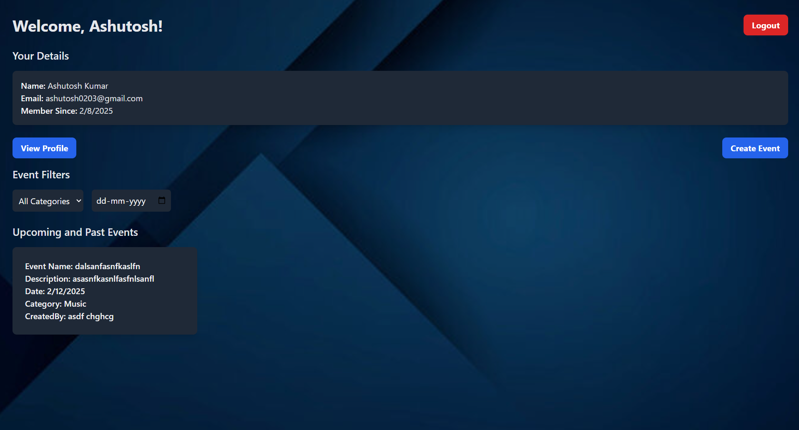
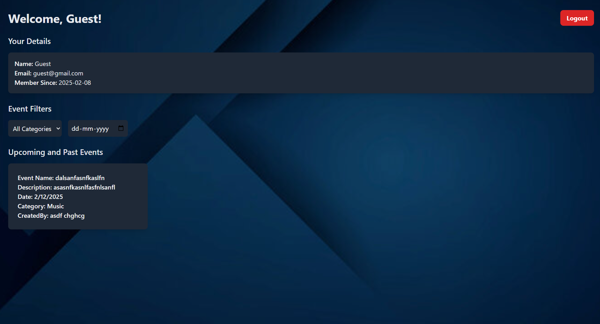
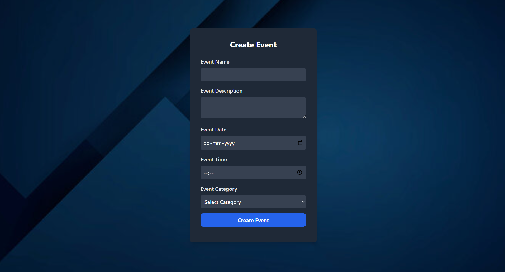
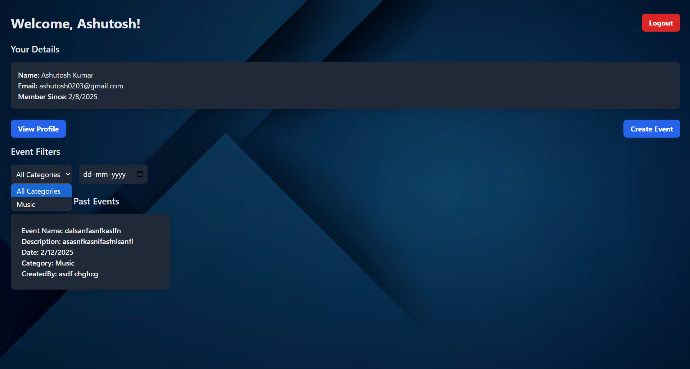
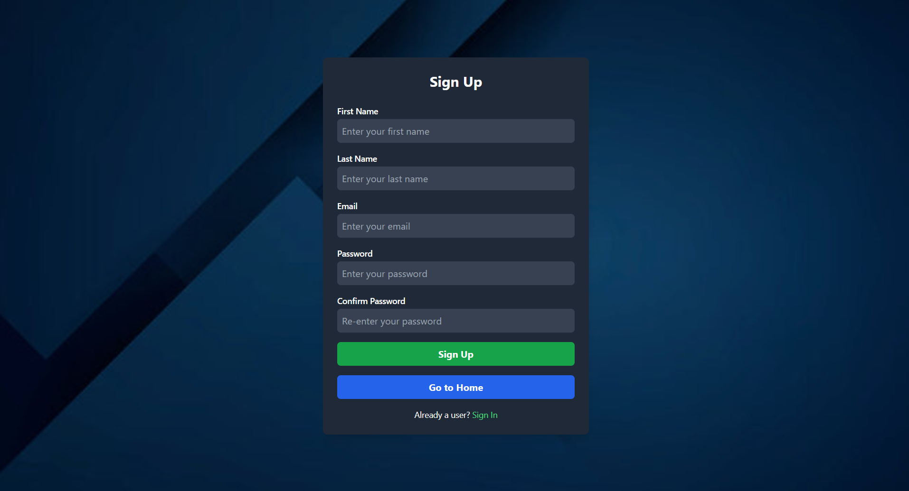
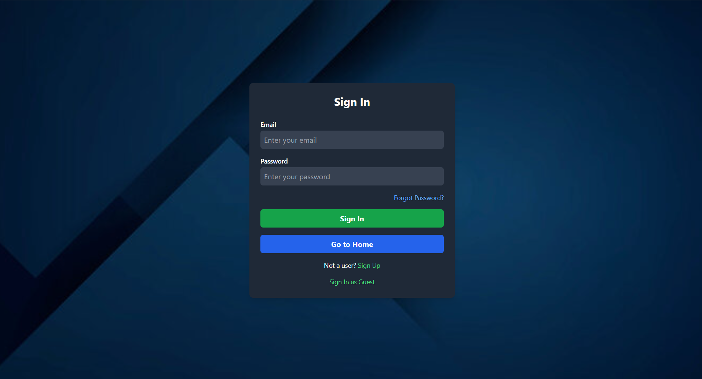

# Event Management Portal
Easily create and manage your events with our intuitive platform.<br/> 
Upload and organize images, track attendees, and manage event details all in one place!

## Features
User and Event Dashboard: Dashboard for users and events
<br/>

<br/>

Guest Dashboard: Dashboard for guests
<br/>

<br/>

Event Creation: Users can create and manage Events
<br/>
 
<br/>

Filtering of Events: Events can be filtered on basis of Category and date
<br/>
 
<br/>

Join and Leave Event: Users can Join or leave a specific event
<br/>
 
<br/>

User and Guest Authentication: User can SignUp or SignIn to the Website to access it's features. Users can signin as Guest and get access to some limited features.
<br/>
 
<br/>
<br/>
 
<br/>

Real-Time Attendee List: Shows the number of attendee for each event in Real-Time

## Installation

To run the Event Management Portal locally, follow these steps:

1. Clone the repository:
```bash
 git clone https://github.com/AshutoshKumar0206/Swissmote-assessment.git
```
2. Navigate to the project directory:
```bash
 cd Swissmote-assessment
```
3. Install the dependencies:
```bash
 npm install
```
4. Start the development server:
```bash
 npm start
```
5. Open your browser and visit http://localhost:3000 to access the application.

## Additional Resources

If you're new to React or need a refresher, the following resources may be helpful:

1. [React Official Documentation](https://react.dev/blog/2023/03/16/introducing-react-dev): The official documentation for React, providing detailed guides, tutorials, and API references.

2. [Create React App](https://create-react-app.dev/docs/getting-started/): Official documentation for creating a new React app using Create React App.

3. [Tailwind CSS Official Documentation](https://tailwindcss.com/docs/installation): The official documentation for Tailwind CSS, providing information about the framework's utility classes and configuration options.

## Acknowledgements

Thank you for your interest in the Event Management Portal! If you have any questions or need further assistance, please don't hesitate to reach out.
 
